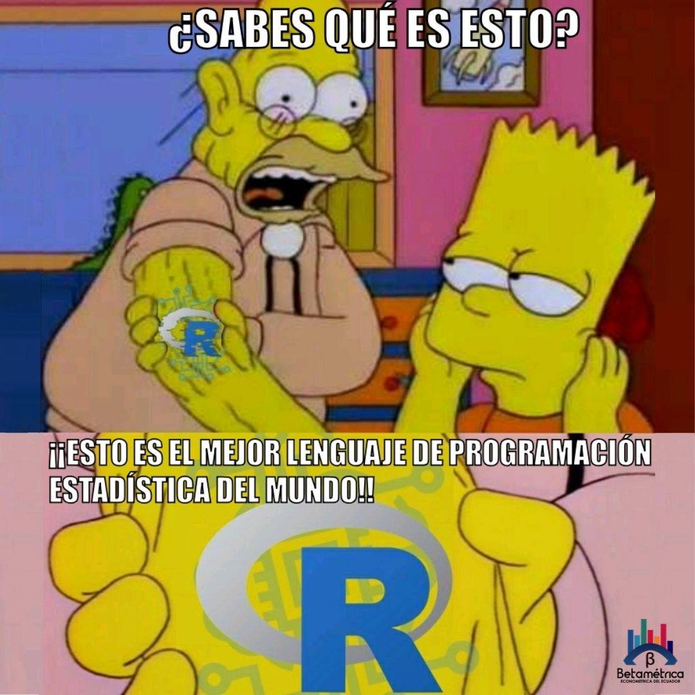

```{r setup, include=FALSE}
knitr::opts_chunk$set(echo = T)
```

## ¿En dónde vamos?

{width=50% height=50%} 


## ¿En dónde vamos?

{width=50% height=50%} 

## ¿Qué sigue?

Usaremos la sintaxis del *tidyverse*, pero ¿qué rayos es el *tidyverse*?

El punto de partida: (https://www.tidyverse.org/)[https://www.tidyverse.org/]

El *tidyverse* es un conjunto de programas (paquetes) para hacer ciencia de datos que permiten componer un flujo de trabajo.


## ¿Qué es el tidyverse?


(Fuente: http://hadley.nz/)

## ¿Qué es el tidyverse?


## ¿Cómo usar el tidyverse?

Una "pipa" para gobernarlos a todos...


- La pipa es el operador unificador del *tidyverse*.


## ¿Qué significa el pipe?

$$f(x)$$


$$x %>% f()$$

## ¿Cómo usar un pipe?


```{r, eval=F}
# Agua de jamaica con Rbase

agua_jamaica <- añadir(hervir(agua), elemento="jamaica")

# Agua de jamaica con dplyr

agua_jamaica <- agua %>%
                  hervir() %>% 
                  añadir("jamaica")
```


