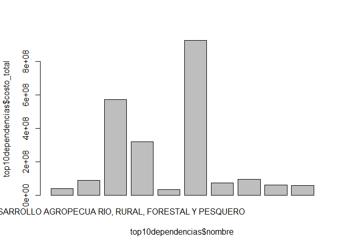
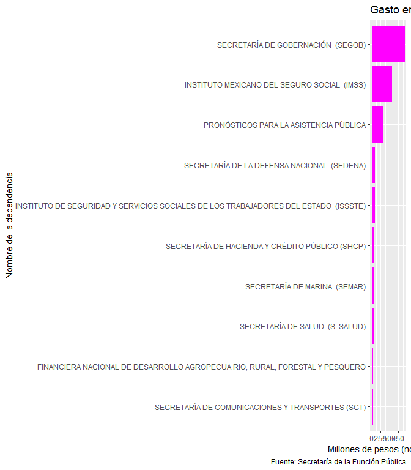

<style>
p.comment {
background-color: #DBDBDB;
padding: 10px;
border: 1px solid black;
margin-left: 25px;
border-radius: 5px;
font-style: italic;
}

.figure {
   margin-top: 20px;
   margin-bottom: 20px;
}

h1.title {
  font-weight: bold;
  font-family: Arial;  
}

h2.title {
  font-family: Arial;  
}

</style>


<style type="text/css">
#TOC {
  font-size: 13px;
  font-family: Arial;
}
</style>

\


## Objetivo

El objetivo de esta sesión es el de entender los 5 procesos fundamentales del *tidyverse*.

1. `select()`
2. `arrange()`
3. `filter()`
4. `mutate()`
5. `group_by() + summarise()`

Para ese fin, haremos una limpieza de datos (*wrangling*) y los trataremos para respondernos una pregunta candente: ¿cómo ha gastado el gobierno federal el dinero destinado a comunicación social?

## Estrategia

Como siempre usaremos una estrategia muy ordenada. Como dijimos la sesión pasada, el orden a niveles obsesivos es siempre una gran inversión de tiempos.

### 0. Setup


```r
rm(list = ls())
```

### 1. Bibliotecas


```r
library(tidyverse)
library(readxl) #Ya instalado con el tidyverse
library(janitor) #Joya
```

### 2. Datos

### 2.1 Descarga

Descargaremos el archivo directamente desde el código.


```r
url <- "http://funcionpublica.gob.mx/web/transparencia/transparencia-focalizada/2020/Base_de_datos_Polizas_12_Diciembre-2019_Definitivo_Transp.xlsx"

destfile <- "datos/comsoc.xlsx"

download.file(url, destfile, mode = "wb")
```

#### 2.2 Importar

El resultado de la importación es una cosa horrible.

Aquí podrías utilizar el modo *manual* también.


```r
comsoc.19 <- read_excel("datos/comsoc.xlsx")
```

```
## New names:
## * `` -> ...1
## * `` -> ...2
## * `` -> ...3
## * `` -> ...5
## * `` -> ...6
## * ...
```

```r
comsoc.19
```

```
## # A tibble: 12,340 x 27
##    ...1  ...2  ...3  `SECRETARÍA DE ~ ...5  ...6  ...7  ...8  ...9  ...10 ...11
##    <chr> <chr> <chr> <chr>            <chr> <chr> <chr> <chr> <chr> <chr> <chr>
##  1 <NA>  <NA>   <NA> Todos los monto~ <NA>  <NA>  <NA>  <NA>  <NA>  <NA>  <NA> 
##  2 <NA>  <NA>   <NA> PERÍODO: ENERO ~ <NA>  <NA>  <NA>  <NA>  <NA>  <NA>  <NA> 
##  3 <NA>  CS066 "Con~ <NA>             <NA>  <NA>  <NA>  <NA>  <NA>  <NA>  <NA> 
##  4 <NA>  <NA>  "Fec~ <NA>             <NA>  <NA>  <NA>  <NA>  <NA>  <NA>  <NA> 
##  5 Sect~ Tipo~ "Ent~ Nombre           Mes   Fech~ Part~ Póli~ Cons. No. ~ Fech~
##  6 0     E     "625" INSTITUTO NACIO~ 12    43830 36101 14331 1     DAOP~ 43691
##  7 0     E     "625" INSTITUTO NACIO~ 12    43830 36101 14331 1     DAOP~ 43691
##  8 0     E     "625" INSTITUTO NACIO~ 12    43830 36101 14331 0     DAOP~ 43691
##  9 0     E     "625" INSTITUTO NACIO~ 12    43830 36101 14331 0     DAOP~ 43691
## 10 0     E     "625" INSTITUTO NACIO~ 12    43830 36101 14410 10    DAOP~ 43691
## # ... with 12,330 more rows, and 16 more variables: ...12 <chr>, ...13 <chr>,
## #   ...14 <chr>, ...15 <chr>, ...16 <chr>, ...17 <chr>, ...18 <chr>,
## #   ...19 <chr>, ...20 <chr>, ...21 <chr>, ...22 <chr>, ...23 <chr>,
## #   ...24 <chr>, ...25 <chr>, ...26 <chr>, ...27 <chr>
```

¿Qué observas?, ¿qué está mal?, ¿cómo podríamos solucionarlo?

#### 2.3 Wrangling

De entrada, *MS Excel* se acomoda por hojas de cálculo en libros. Entonces, lo primero es observar cómo podemos quedarnos solamente con la información relevante. Vamos por pasos.

De entrada, R lee la primera hoja, pero no es la única que comprende este archivo.


```r
excel_sheets(path = "datos/comsoc.xlsx") # Nombres de las hojas
```

```
## [1] "Pólizas C-3600 Dic-2019 Defini"  "Pólizas P-33605 Dic-2019 Defini"
```


Segundo, con `skip` podemos brincarnos los renglones que nos estorban en el título y que ponen el logo de la dependencia.


```r
comsoc.19a <- read_excel("datos/comsoc.xlsx", 
                        skip=5,
                        sheet = "Pólizas C-3600 Dic-2019 Defini")

comsoc.19b <- read_excel("datos/comsoc.xlsx", 
                        skip=5,
                        sheet = "Pólizas P-33605 Dic-2019 Defini")

comsoc.19 <- bind_rows(comsoc.19a, comsoc.19b)
```

Tercero, y como el tiempo apremia, podemos filtrar aquellas observaciones que tienen espacio vacío en *Costo*. Esta estrategia es útil, pero falta un paso. Como el excel


```r
comsoc.19.limpio <- comsoc.19 %>% 
  filter(!is.na(Costo)) %>% 
  filter(Sector != "Sector") 

comsoc.19.limpio
```

```
## # A tibble: 7,625 x 27
##    Sector `Tipo Instituci~ Entidad Nombre Mes   `Fecha de gasto` Partida Póliza
##    <chr>  <chr>            <chr>   <chr>  <chr> <chr>            <chr>   <chr> 
##  1 0      E                625     INSTI~ 12    43830            36101   14331 
##  2 0      E                625     INSTI~ 12    43830            36101   14331 
##  3 0      E                625     INSTI~ 12    43830            36101   14410 
##  4 0      E                625     INSTI~ 12    43830            36101   14410 
##  5 0      E                625     INSTI~ 12    43830            36101   14410 
##  6 0      E                625     INSTI~ 12    43830            36101   14410 
##  7 0      E                625     INSTI~ 12    43830            36101   14410 
##  8 0      E                625     INSTI~ 12    43830            36101   14410 
##  9 0      E                625     INSTI~ 12    43830            36101   14410 
## 10 0      E                625     INSTI~ 12    43830            36101   14410 
## # ... with 7,615 more rows, and 19 more variables: Cons. <chr>, `No. de
## #   Contrato/Pedido` <chr>, `Fecha de Contrato/Pedido` <chr>, Producto <chr>,
## #   `Descripción Producto` <chr>, Importe <chr>, IVA <chr>, `Persona
## #   (F/M)` <chr>, `Clase de Beneficiario` <chr>, Beneficiario <chr>,
## #   Campaña <chr>, Intercambio <chr>, `Unidad de medida` <chr>, `Descripción
## #   Unidad` <chr>, Cantidad <chr>, `Costo Unitario` <chr>, Costo <chr>, `IVA
## #   del Costo` <chr>, `Notas aclaratorias` <chr>
```


```r
glimpse(comsoc.19.limpio)
```

```
## Rows: 7,625
## Columns: 27
## $ Sector                     <chr> "0", "0", "0", "0", "0", "0", "0", "0", ...
## $ `Tipo Institución`         <chr> "E", "E", "E", "E", "E", "E", "E", "E", ...
## $ Entidad                    <chr> "625", "625", "625", "625", "625", "625"...
## $ Nombre                     <chr> "INSTITUTO NACIONAL DE LOS PUEBLOS INDÍG...
## $ Mes                        <chr> "12", "12", "12", "12", "12", "12", "12"...
## $ `Fecha de gasto`           <chr> "43830", "43830", "43830", "43830", "438...
## $ Partida                    <chr> "36101", "36101", "36101", "36101", "361...
## $ Póliza                     <chr> "14331", "14331", "14410", "14410", "144...
## $ Cons.                      <chr> "1", "0", "10", "0", "1", "2", "3", "4",...
## $ `No. de Contrato/Pedido`   <chr> "DAOP-031-22-2019", "DAOP-031-22-2019", ...
## $ `Fecha de Contrato/Pedido` <chr> "43691", "43691", "43691", "43691", "436...
## $ Producto                   <chr> "37", "21", "22", "22", "22", "22", "22"...
## $ `Descripción Producto`     <chr> "INTERNET", "DIARIOS EDITADOS EN LA CD. ...
## $ Importe                    <chr> NA, NA, NA, NA, NA, NA, NA, NA, NA, NA, ...
## $ IVA                        <chr> NA, NA, NA, NA, NA, NA, NA, NA, NA, NA, ...
## $ `Persona (F/M)`            <chr> "M", "M", "M", "M", "M", "M", "M", "M", ...
## $ `Clase de Beneficiario`    <chr> "P", "P", "P", "P", "P", "P", "P", "P", ...
## $ Beneficiario               <chr> "LA JORNADA, DEMOS DESARROLLO DE MED IOS...
## $ Campaña                    <chr> "051/19-2001-TC22-00625", "051/19-2001-T...
## $ Intercambio                <chr> NA, NA, NA, NA, NA, NA, NA, NA, NA, NA, ...
## $ `Unidad de medida`         <chr> "99", "28", "28", "28", "28", "28", "28"...
## $ `Descripción Unidad`       <chr> "OTRO FORMATO (ESPECIFICAR EN NOTAS ACLA...
## $ Cantidad                   <chr> "1", "2", "20", "6", "20", "9", "18", "9...
## $ `Costo Unitario`           <chr> "58070.720000000001", "50925", "5988.83"...
## $ Costo                      <chr> "58070.720000000001", "101850", "119776....
## $ `IVA del Costo`            <chr> "9291.32", "16296", "19164.259999999998"...
## $ `Notas aclaratorias`       <chr> "BOX BANNER", NA, NA, NA, NA, NA, NA, NA...
```


```r
comsoc.19.limpio <- comsoc.19.limpio %>% 
  mutate(Costo = as.numeric(Costo)) %>% # Convertir caracter a números
  arrange(-Costo) %>% 
  clean_names() ## Limpiar nombres

glimpse(comsoc.19.limpio )
```

```
## Rows: 7,625
## Columns: 27
## $ sector                   <chr> "0", "4", "4", "0", "4", "0", "4", "0", "0...
## $ tipo_institucion         <chr> "E", "D", "D", "E", "D", "E", "D", "E", "E...
## $ entidad                  <chr> "641", "4000", "4000", "641", "4000", "641...
## $ nombre                   <chr> "INSTITUTO MEXICANO DEL SEGURO SOCIAL  (IM...
## $ mes                      <chr> "12", "12", "12", "12", "12", "12", "12", ...
## $ fecha_de_gasto           <chr> "43775", "43861", "43861", "43817", "43878...
## $ partida                  <chr> "36101", "36101", "36101", "36101", "36101...
## $ poliza                   <chr> "PO03789490", "3002445", "3002446", "PO038...
## $ cons                     <chr> "3", "0", "0", "1", "0", "12", "0", "2", "...
## $ no_de_contrato_pedido    <chr> "UCSA190922020010", NA, NA, "UCSA190922020...
## $ fecha_de_contrato_pedido <chr> "43698", NA, NA, "43698", NA, "43698", NA,...
## $ producto                 <chr> "31", "31", "31", "31", "31", "31", "31", ...
## $ descripcion_producto     <chr> "TELEVISIÓN ABIERTA NACIONAL", "TELEVISIÓN...
## $ importe                  <chr> NA, NA, NA, NA, NA, NA, NA, NA, NA, NA, NA...
## $ iva                      <chr> NA, NA, NA, NA, NA, NA, NA, NA, NA, NA, NA...
## $ persona_f_m              <chr> "M", "M", "M", "M", "M", "M", "M", "M", "M...
## $ clase_de_beneficiario    <chr> "T", "T", "T", "T", "T", "T", "T", "T", "T...
## $ beneficiario             <chr> "ESTUDIOS AZTECA, S.A. DE C.V.", "GRUPO TE...
## $ campana                  <chr> "069/19-2001-TC23-00641", "054/19-2001-TC2...
## $ intercambio              <chr> NA, NA, NA, NA, NA, NA, NA, NA, NA, NA, NA...
## $ unidad_de_medida         <chr> "18", "99", "99", "18", "99", "18", "4", "...
## $ descripcion_unidad       <chr> "SPOT DE 30 SEGUNDOS", "OTRO FORMATO (ESPE...
## $ cantidad                 <chr> "1", "1", "1", "1", "1", "1", "1", "1", "1...
## $ costo_unitario           <chr> "27241379.309999999", "25862068.949999999"...
## $ costo                    <dbl> 27241379, 25862069, 25858402, 22327586, 20...
## $ iva_del_costo            <chr> "4358620.6900000004", "4137931.03", "41373...
## $ notas_aclaratorias       <chr> NA, "CAMPAÑA: ADICCI0NES. VERSIÓNES: DATE ...
```

### 3 Análisis

#### 3.1 Pregunta: ¿Qué dependencia ha gastado más en publicidad oficial?

- **Hipótesis**: Secretaría de Salud es la que más ha gastado.


```r
dependencias <- comsoc.19.limpio %>%
  group_by(nombre) %>% 
  summarise(costo_total = sum(costo)) %>% 
  arrange(-costo_total)%>% 
  ungroup %>% 
  mutate(proporcion = costo_total/sum(costo_total)) %>% 
  mutate(proporcion =round(proporcion*100, 2))
```

```
## `summarise()` ungrouping output (override with `.groups` argument)
```

¿Cómo filtrar solamente a la Defensa?


```r
dependencias %>% 
  filter(str_detect(nombre, "Defensa|DEFENSA|defensa"))
```

```
## # A tibble: 2 x 3
##   nombre                                                  costo_total proporcion
##   <chr>                                                         <dbl>      <dbl>
## 1 SECRETARÍA DE LA DEFENSA NACIONAL  (SEDENA)               94225186.       3.47
## 2 PROCURADURÍA DE LA DEFENSA DEL CONTRIBUYENTE (PRODECON)   29651565.       1.09
```

```r
dependencias %>% 
  filter(nombre == "SECRETARÍA DE LA DEFENSA NACIONAL  (SEDENA)")
```

```
## # A tibble: 1 x 3
##   nombre                                      costo_total proporcion
##   <chr>                                             <dbl>      <dbl>
## 1 SECRETARÍA DE LA DEFENSA NACIONAL  (SEDENA)   94225186.       3.47
```


#### 3.2 Pregunta: ¿Qué empresa ha cobrado más en publicidad oficial?

- **Hipótesis**: TV Azteca es la que más ha gastado.


```r
names(comsoc.19.limpio)
```

```
##  [1] "sector"                   "tipo_institucion"        
##  [3] "entidad"                  "nombre"                  
##  [5] "mes"                      "fecha_de_gasto"          
##  [7] "partida"                  "poliza"                  
##  [9] "cons"                     "no_de_contrato_pedido"   
## [11] "fecha_de_contrato_pedido" "producto"                
## [13] "descripcion_producto"     "importe"                 
## [15] "iva"                      "persona_f_m"             
## [17] "clase_de_beneficiario"    "beneficiario"            
## [19] "campana"                  "intercambio"             
## [21] "unidad_de_medida"         "descripcion_unidad"      
## [23] "cantidad"                 "costo_unitario"          
## [25] "costo"                    "iva_del_costo"           
## [27] "notas_aclaratorias"
```

```r
glimpse(comsoc.19.limpio)
```

```
## Rows: 7,625
## Columns: 27
## $ sector                   <chr> "0", "4", "4", "0", "4", "0", "4", "0", "0...
## $ tipo_institucion         <chr> "E", "D", "D", "E", "D", "E", "D", "E", "E...
## $ entidad                  <chr> "641", "4000", "4000", "641", "4000", "641...
## $ nombre                   <chr> "INSTITUTO MEXICANO DEL SEGURO SOCIAL  (IM...
## $ mes                      <chr> "12", "12", "12", "12", "12", "12", "12", ...
## $ fecha_de_gasto           <chr> "43775", "43861", "43861", "43817", "43878...
## $ partida                  <chr> "36101", "36101", "36101", "36101", "36101...
## $ poliza                   <chr> "PO03789490", "3002445", "3002446", "PO038...
## $ cons                     <chr> "3", "0", "0", "1", "0", "12", "0", "2", "...
## $ no_de_contrato_pedido    <chr> "UCSA190922020010", NA, NA, "UCSA190922020...
## $ fecha_de_contrato_pedido <chr> "43698", NA, NA, "43698", NA, "43698", NA,...
## $ producto                 <chr> "31", "31", "31", "31", "31", "31", "31", ...
## $ descripcion_producto     <chr> "TELEVISIÓN ABIERTA NACIONAL", "TELEVISIÓN...
## $ importe                  <chr> NA, NA, NA, NA, NA, NA, NA, NA, NA, NA, NA...
## $ iva                      <chr> NA, NA, NA, NA, NA, NA, NA, NA, NA, NA, NA...
## $ persona_f_m              <chr> "M", "M", "M", "M", "M", "M", "M", "M", "M...
## $ clase_de_beneficiario    <chr> "T", "T", "T", "T", "T", "T", "T", "T", "T...
## $ beneficiario             <chr> "ESTUDIOS AZTECA, S.A. DE C.V.", "GRUPO TE...
## $ campana                  <chr> "069/19-2001-TC23-00641", "054/19-2001-TC2...
## $ intercambio              <chr> NA, NA, NA, NA, NA, NA, NA, NA, NA, NA, NA...
## $ unidad_de_medida         <chr> "18", "99", "99", "18", "99", "18", "4", "...
## $ descripcion_unidad       <chr> "SPOT DE 30 SEGUNDOS", "OTRO FORMATO (ESPE...
## $ cantidad                 <chr> "1", "1", "1", "1", "1", "1", "1", "1", "1...
## $ costo_unitario           <chr> "27241379.309999999", "25862068.949999999"...
## $ costo                    <dbl> 27241379, 25862069, 25858402, 22327586, 20...
## $ iva_del_costo            <chr> "4358620.6900000004", "4137931.03", "41373...
## $ notas_aclaratorias       <chr> NA, "CAMPAÑA: ADICCI0NES. VERSIÓNES: DATE ...
```

```r
empresa <- comsoc.19.limpio %>%
  mutate(Costo = as.numeric(costo)) %>%  # Convertir caracter a números
  group_by(beneficiario) %>% ### El grupo que define la empresa
  summarise(costo_total = sum(Costo)) %>% 
  arrange(-costo_total) %>% 
  ungroup %>% 
  mutate(proporcion = costo_total/sum(costo_total)) %>% 
  mutate(proporcion =round(proporcion*100, 2))
```

```
## `summarise()` ungrouping output (override with `.groups` argument)
```


#### 3.3 Pregunta: ¿Qué producto es el que mas se vende?


```r
producto <- comsoc.19.limpio %>% 
  group_by(descripcion_producto) %>% ### El grupo que define la empresa
  summarise(costo_total = sum(costo)) %>% 
  arrange(-costo_total) %>% 
  ungroup %>% 
  mutate(proporcion = costo_total/sum(costo_total)) %>% 
  mutate(proporcion =round(proporcion*100, 2))
```

```
## `summarise()` ungrouping output (override with `.groups` argument)
```


### 4. Algunas visualizaciones

#### Rbase


```r
top10dependencias <- dependencias %>% 
  head(10) 

barplot(top10dependencias$costo_total ~ top10dependencias$nombre)
```

<!-- -->


### tidyverse


```r
qplot(y= reorder(nombre, costo_total), 
      x=costo_total/1000000, # Para expresar los valores en millones de pesos
      data=top10dependencias, geom="col") + #En GG el signo de más pone una nueva capa gráfica
  labs(title= "Gasto en publicidad oficial por dependencia",
       x="Millones de pesos (nominales)", 
       y="Nombre de la dependencia",
       caption = "Fuente: Secretaría de la Función Pública") +
  geom_col(fill="magenta")
```

<!-- -->

```r
#ggsave("outputs/img.png", width = 10, height = 8)

#library(svglite)

#ggsave("outputs/img.svg", width = 15, height = 8)
```


### Bonus track: Filtros con caracteres.

- Pregunta: ¿Cuánto costó la camapaña vs las adicciones?


```r
adicciones <- comsoc.19.limpio %>% 
  filter(str_detect(notas_aclaratorias,
                    "ADI.*S"))

sum(adicciones$costo)
```

```
## [1] 446164351
```


